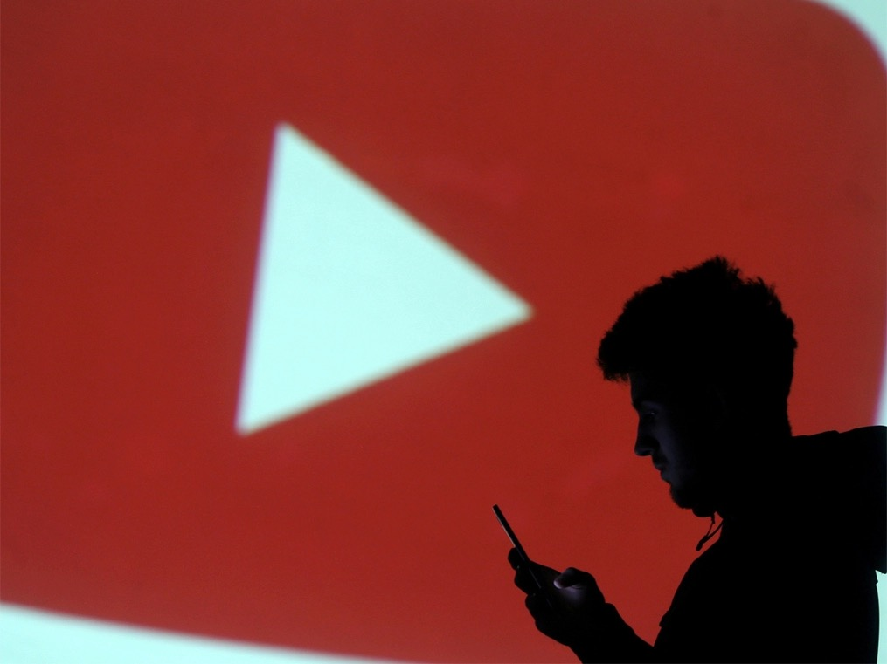
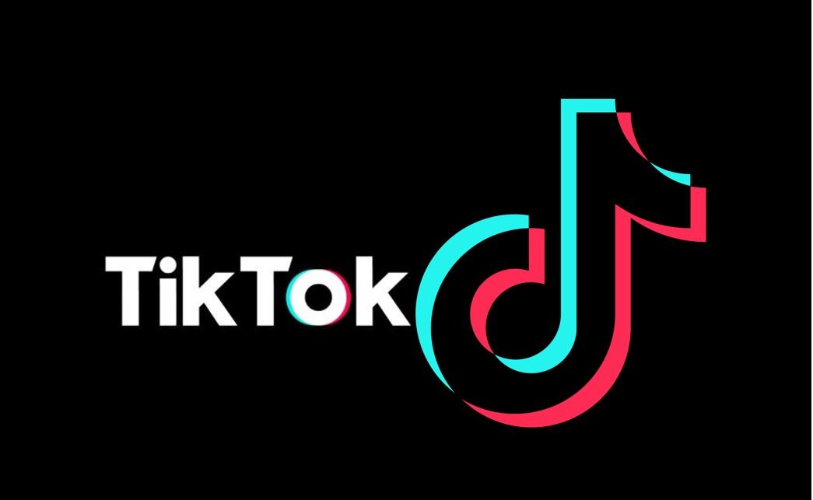

# “Short-Form Video”— New advertising strategy that company must need to know

## Here is an introduction

The popularity of Tik Tok and YouTube has redefined the social media market and become a marketing trend for companies to develop. The combination of "short-form video" and the Internet maximize the power of this innovative marketing form from both sides. From this perspective, let’s see more about what this innovative marketing form is and how it works for businesses. 

   

## 1.	What are the short-form videos? 

Before learning how this innovative marketing form can contribute to the business, we firstly need to define short-form videos. The short-form video is generally indicated as a video piece between 30 seconds and 3 minutes long, which targets customers of all ages, especially millennials. The viewer could see those videos from the News site, Tik Tok, Instagram, and other social media channels. Otherwise, it’s the primary source of information for younger populations.

## 2.	How to use it for marketing? 

One of choices for the company is collaborating with the media influencers, which is called User-Generated Content. It’s a budget-saving strategy without wasting extra resources. Based on the brand, content producers create fun videos to attract people's attention. Secondly, companies could show their brand stories through those short-form videos. In this way, consumers may feel more connection to the brand when the CEO is active on this social media. The last one is to create videos with educational information to help people from various ways in their daily life. By doing this, the potential number of fixed customers will increase for the brand, which effectively cultivates brand loyalty.

However, social media algorithms are inevitable challenges for marketers. By default, social media algorithms decided what content will be delivered to users, based on their reactions. Hence, how to craft the sort of posts that could be promoted to users by algorithms? The first suggestion is to increase the reactions for your post, including likes, comments, and shares. Asking a question or call to action can be a way to achieve this. Besides, tagging other accounts and wisely using hashtags can make your content searchable for audiences. Don’t forget to release more posts since the accounts that frequently send posts are preferred to be rewarded based on social media algorithms. 

## 3.	Why is it so popular?

Firstly, Short-Form Video has a high spreading speed. For instance, George Allen, a Republican candidate from Virginia, publicly call an Indian American “Macca” in the audience during a speech. The short video was posted on YouTube and quickly reposted by viewers, leading to a rapid decline of his reputation. Finally, he lost the US presidential election.

Secondly, Short Video is an expressive form of content. Compared to directly telling a brand story, Short-form videos focus on arousing users with emotions and characters so that customers can build a connection with the brand's products and services. For instance, Disney has collaborated with Vine to encourage fans to show their love for Disney by making short videos. The campaign won a huge success and help Disney gather a lot of ideas for company's advertising and creation.

Finally, Short videos are the social card for the young. For the millennial generation, traditional media like newspapers, TV advertisements cannot attract them anymore. Short videos have become the most popular way of socializing among young audiences. In this busy modern life, small and concise short videos are more suitable for people to catch. 

## Bottom line:

Don’t hesitate. Contact us to grow your business Short-Form Video!

